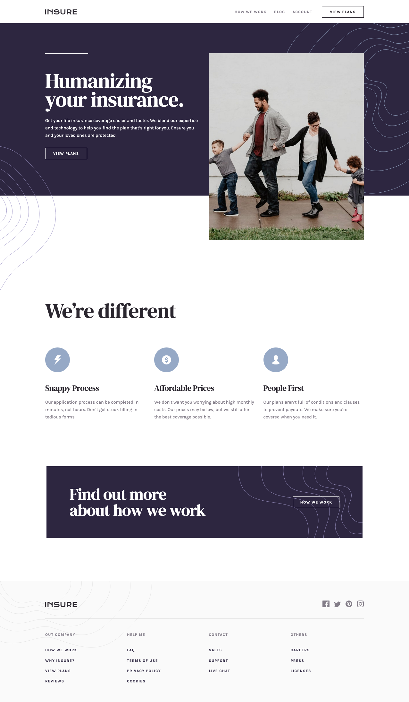

# Insure landing page solution

This is a solution to the [Insure landing page challenge on Frontend Mentor](https://www.frontendmentor.io/challenges/insure-landing-page-uTU68JV8). Frontend Mentor challenges help you improve your coding skills by building realistic projects.

## About the Project

The "Insure Landing Page" is a Frontend Mentor challenge aimed at creating an engaging landing page for an insurance company. This project was crafted using React with Vite for a swift development environment and Scss for styling, focusing on delivering a modern and user-friendly experience.

## Preview and Links

<b>Open Preview</b>

 

 

| View it live: | [Live Demo URL](https://ionstici.github.io/insure-landing-page/) | [Frontend Mentor](https://www.frontendmentor.io/solutions/insure-landing-page-ehFGCjU3yS) |
| ------------- | ---------------------------------------------------------------- | ----------------------------------------------------------------------------------------- |

## Features

- **Modern Design:** A contemporary look tailored for an insurance service.
- **Responsive Layout:** Ensures optimal viewing experience on all devices.
- **Interactive Elements:** Includes subtle animations and hover effects for enhanced user interaction.

## Tech Stack

- **React:** For component-based development.
- **Vite:** To provide a fast and efficient development setup.
- **Scss:** For styling, allowing for modular and maintainable CSS.

## Deployment

This project uses **GitHub Pages** for hosting.
